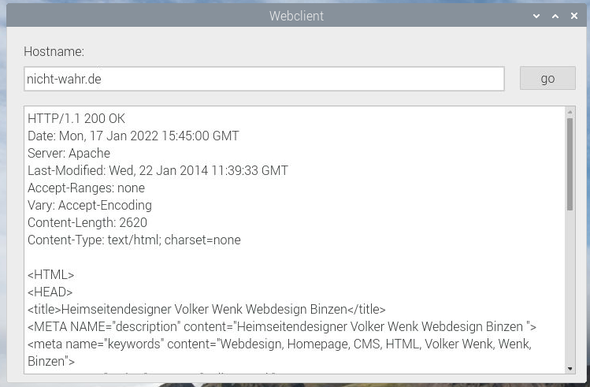

# Programmieraufgabe Webclient

Basierend auf dem vorliegenden Qt-Programmgerüst soll ein einfacher Webclient programmiert werden. 

## Lösungsschritte
1. Logge dich auf deinem Account auf github über den Webbrowser ein
2. Navigiere mit dem Browser zu diesem Repository: 
 https://github.com/eneukirchner/Webclient 
3. Erstelle einen Fork davon auf deinem github-Account (fork-Button rechts oben auf der github-Website).
4. Kopiere den Fork auf deinen Raspberry: `git clone git@github.com:<dein Accountname>/Webclient.git`. 
   In dem dadurch erzeugten Ordner befindet sich das Projekt. 
5. Die zu erstellende grafische Benutzeroberfläche soll in der Funktionalität der Vorlage (lauffähiges Programm unter `./bin/Webclient`) entsprechen. Erstelle den  C++ - Quellcode, sodass nach Eingabe des Hostnamens (z.B. localhost) und Drücken des "go"- Buttons die Antwort des Servers im Textformat erscheint. Falls keine Verbindung mit dem Server zustande kommt, soll nach einem Timeout von einigen Sekunden die Meldung "connect failed!" im textBrowser-Fenster erscheinen.  
*Tipp: die meisten Websites sind mittlerweile SSL-verschlüsselt, daher kommt dann bei einem unverschlüsselten Connect eine Fehlermeldung. localhost funktioniert, wenn auf deinem Raspberry der Webserver `apache2` läuft.*
6. Wenn alles wunschgemäß funktioniert, lade den aktualisierten Quellcode wieder auf deinen Account (git-Ablauf wie gelernt).

## Dein Name: 
